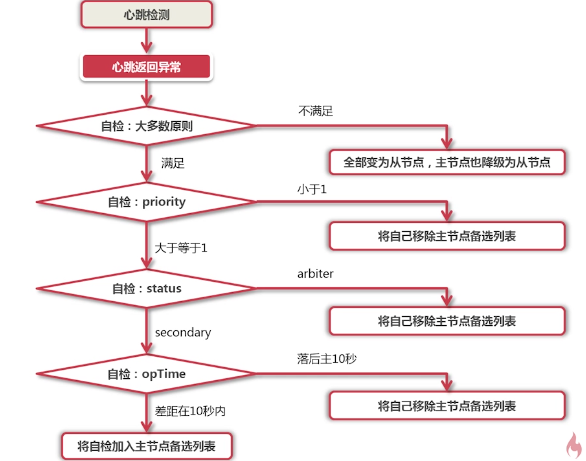
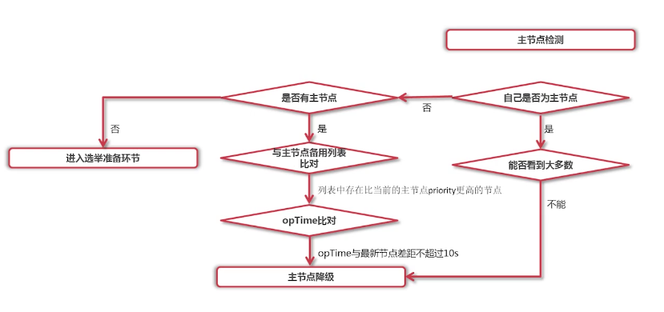
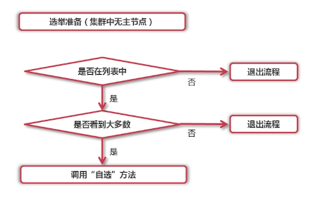
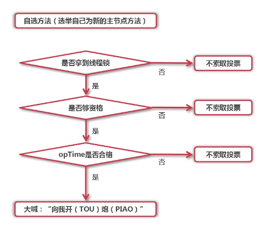
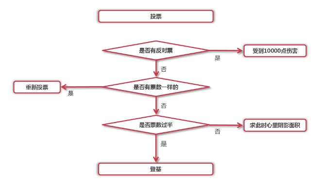

## 同步机制
客户端请求主节点进行写操作，主节点将相应的操作记录在oplog中，
从节点根据oplog对自身的数据进行相应的操作，来让数据保持一致性。

### > oplog(operation-log)
作用：记录主节点写入操作，充当复制源
特性：封顶表(Capped collection)，滚动覆盖写入，固定大小
默认大小：当前分区可用大小的5%，默认最大不会超过50G
在配置文件中，通过--oplogSize(单位：MB)指定

    如果封顶表容量满了，会覆盖最早插入的数据
    数据流：        --------------
    过去时间段：    |---------|
    当前时间段：      |----------|
    //封顶表的创建
    db.createCollection(
        'coll_name',
        {
            capped:true,
            size:4*1024*1024*1024 //单位：byte
        }
    )

#### >> 查看oplog
    use local
    show tables
    db.oplog.rs.find().sort({$natural:-1}).limit(1)

#### >> oplog格式
    {
        ts:Timestamp(1493537752,1),
        t:NumberLong(2),
        h:NumberLong('-702...'),
        v:2,
        op:'i',
        ns:'person.student',
        o:{
            _id:ObjectId('590...'),
            name:'张三',
            age:10
        }
    }

oplog参数
- ts：操作发生时的时间戳
- h：此操作的独一无二的标识
- v：oplog的版本
- op：操作类型 i(insert),u(update),d(delete),c(db cmd),n(null)
- ns：操作所处的命名空间 db_name.coll_name(数据库名.表名)
- o：操作对应的文档，文档在更新前的状态
- o2：仅update操作时有，更新操作的变更条件

## 故障处理

### > 大多数原则
存活节点的个数大于总节点的二分之一，才会触发选举。

在机房A中有四个节点，其中有一个主节点，在机房B中有三个节点。
如果机房A和B的通讯断了，机房B中的三个节点，因为不满足大多数原则，就不会触发选举，
这样就可以避免，机房A和B通讯重新连接之后，出现两个主节点的情况。

### > 选举触发时机
1. 主节点宕机
2. 主节点网络不可达
3. 人工干预，rs.stepDown(5) 5秒之内不能再被选为主节点

### > 选举流程
问题：子节点如何判断opTime与主节点的插值，这个时候已经连接不上主节点了。

1. 心跳检测
    ```
    作用：检测主节点是否正常，检测复制集是否满足大多数原则
    频率：1次/2秒
    ```
2. 维护主节点备选列表

    

3. 主节点检测

    

4. 选举准备

    

5. 自选方法验证

    

6. 投票

    

## 数据回滚
节点1为主节点，产生四个写数据，其他节点，没有完全复制，节点1就挂掉了。
这时选取了节点2为主节点，继续提供服务。
当节点1重新启动后，去复制节点2的数据的时候，它会比对数据是否一致，
当节点1发现有些数据和节点2的数据不一致时，节点1会把这些数据放入rollback中，记录一下，
然后再复制复制节点2的数据，保证数据的一致性。

## 驱动API
正确配置MongoDB的连接
自动isMaster() 判断当前复制集的主节点是谁
五种读策略：只读主、优先主、只读从、优先从、就近(网络延迟)

## 复制集的管理与维护
#### > 管理
眼光要长远：即使只有一台服务器，也要以单点模式启动复制集
单机多实例启动 单节点启动

#### > 维护
1. 需要暂停维护时：使用单机模式启动。把配置文件的replSet注释掉即可
2. 修改复制集的成员属性。
    ```
    必须在主节点下修改
    config = rs.config();
    config.members[0].priority=5
    rs.reconfig(config)
    ```
3. 人工干预选举：修改priority，rs.freeze()，rs.stepDown()
4. 创建索引：将每一个节点都变为单机模式启动，然后再创建索引，然后再加入复制集中。
5. 调整oplog大小
    ```
    关闭现有服务
    在配置文件中修改oplog大小
    以单机模式启动
    执行下面命令，将修改操作保存在临时文件中
    db.temp.save(
        db.oplog.rs.find().sort({$natural:-1}).limit(-1).next()
    )
    db.temp.find() // 验证是否保存成功
    db.oplog.rs.drop() // 删除原来的oplog
    db.createCollection({ // 以封顶表的形式创建oplog
        'oplog.rs',
        {
            capped:true,
            size:3*1024*1024*1024
        }
    })
    db.oplog.rs.save(db.temp.findOne()) // 将之前保存的最新记录插入到新的oplog中
    以复制集的方式重新启动
    ```
